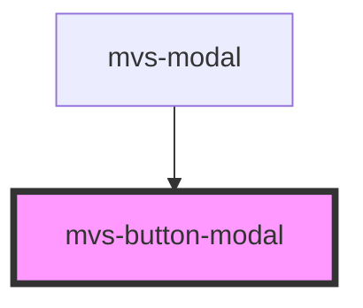

# mvs-button-modal

<!-- Auto Generated Below -->

## Properties

| Property   | Attribute  | Description                                    | Type                                          | Default     |
| ---------- | ---------- | ---------------------------------------------- | --------------------------------------------- | ----------- |
| `bid`      | `bid`      |                                                | `string`                                      | `undefined` |
| `disabled` | `disabled` | Caso `true`, desabilita o botão.               | `boolean`                                     | `false`     |
| `full`     | `full`     | Caso `true`, botão terá largura 100%.          | `boolean`                                     | `false`     |
| `light`    | `light`    | Caso `true`, botão terá tema light/night mode. | `boolean`                                     | `false`     |
| `modal`    | `modal`    |                                                | `string`                                      | `undefined` |
| `type`     | `type`     | Define o tipo do botão.                        | `"button" \| "reset" \| "submit"`             | `'button'`  |
| `variant`  | `variant`  | Define estilo do botão.                        | `"close" \| "contained" \| "flat" \| "ghost"` | `'flat'`    |

## Events

| Event         | Description | Type               |
| ------------- | ----------- | ------------------ |
| `onShowModal` |             | `CustomEvent<any>` |

## Dependencies

### Used by

 - [mvs-modal](../../layout/mvs-modal)

### Graph

----------------------------------------------

*Built with [StencilJS](https://stenciljs.com/)*
