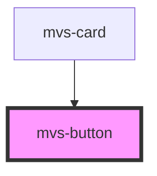

# mvs-button

<!-- Auto Generated Below -->

## Properties

| Property     | Attribute    | Description                           | Type                                  | Default    |
| ------------ | ------------ | ------------------------------------- | ------------------------------------- | ---------- |
| `disabled`   | `disabled`   | Caso `true`, desabilita o botão.      | `boolean`                             | `false`    |
| `full`       | `full`       | Caso `true`, botão terá largura 100%. | `boolean`                             | `false`    |
| `marginzero` | `marginzero` | Caso `true`, botão não terá margens.  | `boolean`                             | `false`    |
| `type`       | `type`       | Define o tipo do botão.               | `"button" \| "reset" \| "submit"`     | `'button'` |
| `variant`    | `variant`    | Define estilo do botão.               | `"contained" \| "outlined" \| "text"` | `'text'`   |

## Dependencies

### Used by

 - [mvs-card](../../layout/mvs-card)

### Graph

----------------------------------------------

*Built with [StencilJS](https://stenciljs.com/)*
