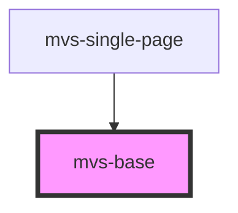

# mvs-base

Componente utilizado para carregar fontes e outros elementos essenciais do sistema de design.

<!-- Auto Generated Below -->

## Dependencies

### Used by

 - [mvs-single-page](../../pages/mvs-single-page)

### Graph

----------------------------------------------

*Built with [StencilJS](https://stenciljs.com/)*
