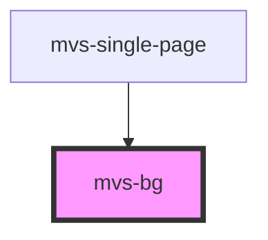

# mvs-bg

Quando utilizado como componente raiz, define a cor de fundo de seus filhos imediatos, alternando entre as duas cores de fundo do tema.

<!-- Auto Generated Below -->

## Dependencies

### Used by

 - [mvs-single-page](../../pages/mvs-single-page)

### Graph

----------------------------------------------

*Built with [StencilJS](https://stenciljs.com/)*
