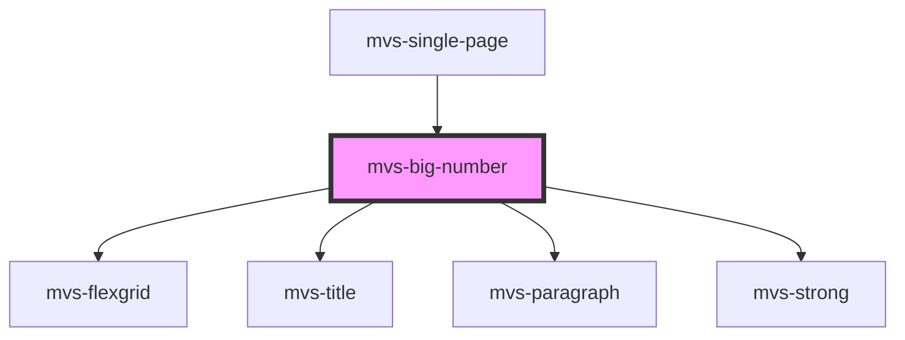

# mvs-big-number

<!-- Auto Generated Below -->

## Properties

| Property   | Attribute  | Description | Type  | Default     |
| ---------- | ---------- | ----------- | ----- | ----------- |
| `elements` | `elements` |             | `any` | `undefined` |

## Dependencies

### Used by

 - [mvs-single-page](../../pages/mvs-single-page)

### Depends on

- [mvs-flexgrid](../mvs-flexgrid)
- [mvs-title](../../typography/mvs-title)
- [mvs-paragraph](../../typography/mvs-paragraph)
- [mvs-strong](../../typography/mvs-strong)

### Graph

----------------------------------------------

*Built with [StencilJS](https://stenciljs.com/)*
