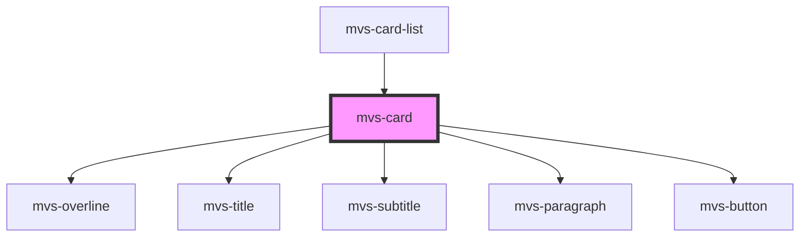

# mvs-card

<!-- Auto Generated Below -->

## Properties

| Property    | Attribute   | Description | Type     | Default                                                                   |
| ----------- | ----------- | ----------- | -------- | ------------------------------------------------------------------------- |
| `alt`       | `alt`       |             | `string` | `'Texto alternativo em falta, favor entrar em contato'`                   |
| `button`    | `button`    |             | `string` | `undefined`                                                               |
| `cardtitle` | `cardtitle` |             | `string` | `undefined`                                                               |
| `link`      | `link`      |             | `string` | `'http://google.com'`                                                     |
| `media`     | `media`     |             | `string` | `'https://material-ui.com/static/images/cards/contemplative-reptile.jpg'` |
| `overline`  | `overline`  |             | `any`    | `undefined`                                                               |
| `subtitle`  | `subtitle`  |             | `string` | `undefined`                                                               |
| `text`      | `text`      |             | `string` | `undefined`                                                               |
| `width`     | `width`     |             | `number` | `undefined`                                                               |

## Dependencies

### Used by

 - [mvs-card-list](../../sections/mvs-card-list)

### Depends on

- [mvs-overline](../../typography/mvs-overline)
- [mvs-title](../../typography/mvs-title)
- [mvs-subtitle](../../typography/mvs-subtitle)
- [mvs-paragraph](../../typography/mvs-paragraph)
- [mvs-button](../../inputs/mvs-button)

### Graph

----------------------------------------------

*Built with [StencilJS](https://stenciljs.com/)*
