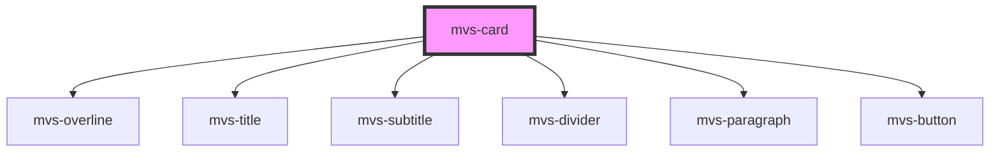

# mvs-card

<!-- Auto Generated Below -->

## Properties

| Property    | Attribute   | Description | Type     | Default               |
| ----------- | ----------- | ----------- | -------- | --------------------- |
| `button`    | `button`    |             | `string` | `undefined`           |
| `cardtitle` | `cardtitle` |             | `any`    | `undefined`           |
| `link`      | `link`      |             | `string` | `'http://google.com'` |
| `overline`  | `overline`  |             | `any`    | `undefined`           |
| `subtitle`  | `subtitle`  |             | `any`    | `undefined`           |
| `width`     | `width`     |             | `number` | `undefined`           |

## Dependencies

### Depends on

- [mvs-overline](../../typography/mvs-overline)
- [mvs-title](../../typography/mvs-title)
- [mvs-subtitle](../../typography/mvs-subtitle)
- [mvs-divider](../../typography/mvs-divider)
- [mvs-paragraph](../../typography/mvs-paragraph)
- [mvs-button](../../inputs/mvs-button)

### Graph

----------------------------------------------

*Built with [StencilJS](https://stenciljs.com/)*
