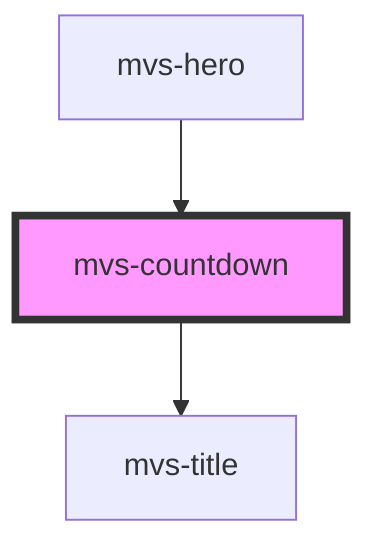

# mvs-countdown

<!-- Auto Generated Below -->

## Properties

| Property      | Attribute      | Description | Type     | Default        |
| ------------- | -------------- | ----------- | -------- | -------------- |
| `deadline`    | `deadline`     |             | `string` | `'2020-09-07'` |
| `endMessage`  | `end-message`  |             | `string` | `undefined`    |
| `hours`       | `hours`        |             | `number` | `undefined`    |
| `minutes`     | `minutes`      |             | `number` | `undefined`    |
| `seconds`     | `seconds`      |             | `number` | `undefined`    |
| `spanProcent` | `span-procent` |             | `any`    | `undefined`    |

## Dependencies

### Used by

 - [mvs-hero](../../mvs-hero)

### Depends on

- [mvs-title](../../typography/mvs-title)

### Graph

----------------------------------------------

*Built with [StencilJS](https://stenciljs.com/)*
