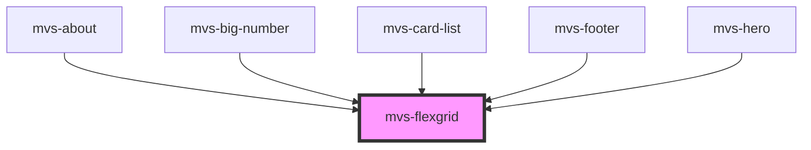

# mvs-flexgrid

Componente para criação de grids para layouts responsivos. Estabelece um `container` de 12 colunas e `item`s que podem ocupar um número fixo de colunas ou se adaptar ao espaço restante.

<!-- Auto Generated Below -->

## Properties

| Property    | Attribute   | Description                                                                                                             | Type                                                                     | Default     |
| ----------- | ----------- | ----------------------------------------------------------------------------------------------------------------------- | ------------------------------------------------------------------------ | ----------- |
| `block`     | `block`     | Altera visualização de flex para block.                                                                                 | `boolean`                                                                | `undefined` |
| `container` | `container` | Caso `true`, o componente se comportará como `container` capaz de receber `items`.                                      | `boolean`                                                                | `undefined` |
| `item`      | `item`      | Caso `true`, o componente se comportará como `item`, contido em um `container`.                                         | `boolean`                                                                | `undefined` |
| `lg`        | `lg`        | Largura do componente no breakpoint Large, entre 1 e 12. Quando omitido, ocupa o espaço restante automaticamente.       | `1 \| 10 \| 11 \| 12 \| 2 \| 3 \| 4 \| 5 \| 6 \| 7 \| 8 \| 9 \| boolean` | `undefined` |
| `md`        | `md`        | Largura do componente no breakpoint Medium, entre 1 e 12. Quando omitido, ocupa o espaço restante automaticamente.      | `1 \| 10 \| 11 \| 12 \| 2 \| 3 \| 4 \| 5 \| 6 \| 7 \| 8 \| 9 \| boolean` | `undefined` |
| `sm`        | `sm`        | Largura do componente no breakpoint Small, entre 1 e 12. Quando omitido, ocupa o espaço restante automaticamente.       | `1 \| 10 \| 11 \| 12 \| 2 \| 3 \| 4 \| 5 \| 6 \| 7 \| 8 \| 9 \| boolean` | `undefined` |
| `spacing`   | `spacing`   | Define espaçamento entre componentes do tipo `item`. Usando somente em componentes tipo `container`.                    | `string`                                                                 | `undefined` |
| `xl`        | `xl`        | Largura do componente no breakpoint Extra Large, entre 1 e 12. Quando omitido, ocupa o espaço restante automaticamente. | `1 \| 10 \| 11 \| 12 \| 2 \| 3 \| 4 \| 5 \| 6 \| 7 \| 8 \| 9 \| boolean` | `undefined` |

## Dependencies

### Used by

 - [mvs-about](../../sections/mvs-about)
 - [mvs-big-number](../mvs-big-number)
 - [mvs-card-list](../../sections/mvs-card-list)
 - [mvs-footer](../../sections/mvs-footer)
 - [mvs-hero](../../mvs-hero)

### Graph

----------------------------------------------

*Built with [StencilJS](https://stenciljs.com/)*
