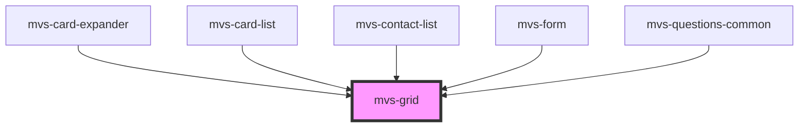

# mvs-grid

<!-- Auto Generated Below -->

## Properties

| Property     | Attribute    | Description | Type      | Default     |
| ------------ | ------------ | ----------- | --------- | ----------- |
| `marginzero` | `marginzero` |             | `boolean` | `undefined` |

## Dependencies

### Used by

 - [mvs-card-expander](../mvs-card-expander)
 - [mvs-card-list](../../sections/mvs-card-list)
 - [mvs-contact-list](../mvs-contact-list)
 - [mvs-form](../mvs-form)
 - [mvs-questions-common](../mvs-questions-common)

### Graph

----------------------------------------------

*Built with [StencilJS](https://stenciljs.com/)*
