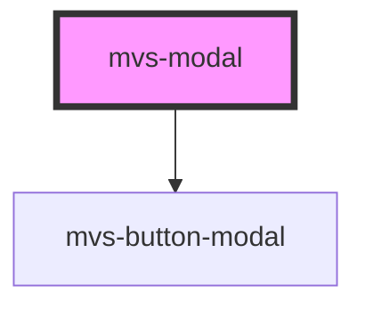

# mvs-modal

<!-- Auto Generated Below -->

## Properties

| Property   | Attribute  | Description | Type                             | Default     |
| ---------- | ---------- | ----------- | -------------------------------- | ----------- |
| `closebtn` | `closebtn` |             | `boolean`                        | `false`     |
| `name`     | `name`     |             | `string`                         | `undefined` |
| `show`     | `show`     |             | `boolean`                        | `undefined` |
| `size`     | `size`     |             | `"large" \| "medium" \| "small"` | `undefined` |

## Dependencies

### Depends on

- [mvs-button-modal](../../inputs/mvs-button-modal)

### Graph

----------------------------------------------

*Built with [StencilJS](https://stenciljs.com/)*
