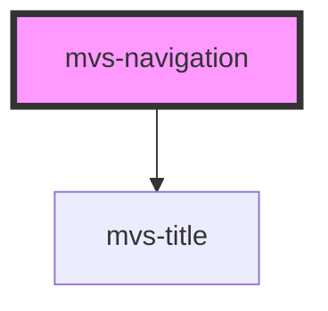

# mvs-navigation

<!-- Auto Generated Below -->

## Properties

| Property | Attribute | Description | Type     | Default         |
| -------- | --------- | ----------- | -------- | --------------- |
| `title`  | `title`   |             | `string` | `'Lorem ipsum'` |

## Events

| Event           | Description | Type               |
| --------------- | ----------- | ------------------ |
| `onShowSidenav` |             | `CustomEvent<any>` |

## Dependencies

### Depends on

- [mvs-title](../../typography/mvs-title)

### Graph

----------------------------------------------

*Built with [StencilJS](https://stenciljs.com/)*
