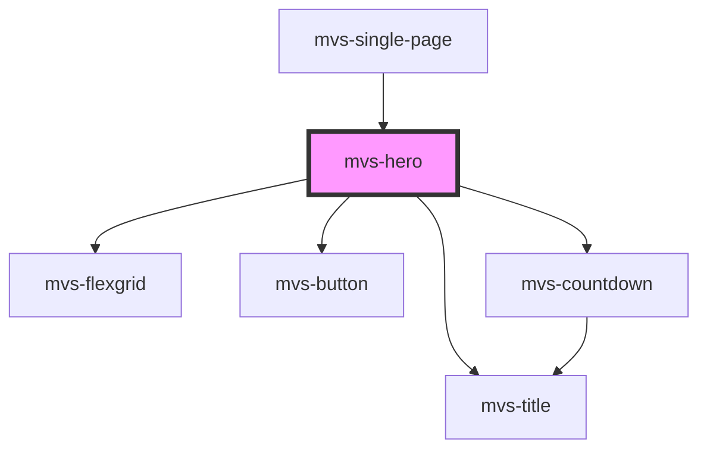

# mvs-hero

<!-- Auto Generated Below -->

## Properties

| Property     | Attribute    | Description | Type     | Default                                                                          |
| ------------ | ------------ | ----------- | -------- | -------------------------------------------------------------------------------- |
| `background` | `background` |             | `string` | `undefined`                                                                      |
| `bgimg`      | `bgimg`      |             | `string` | `'https://admin.100anos.ufrj.br/wp-content/uploads/sites/3/2019/09/100anos.png'` |
| `button`     | `button`     |             | `string` | `undefined`                                                                      |
| `herotitle`  | `herotitle`  |             | `string` | `undefined`                                                                      |

## Dependencies

### Used by

 - [mvs-single-page](../pages/mvs-single-page)

### Depends on

- [mvs-flexgrid](../layout/mvs-flexgrid)
- [mvs-title](../typography/mvs-title)
- [mvs-button](../inputs/mvs-button)
- [mvs-countdown](../layout/mvs-countdown)

### Graph

----------------------------------------------

*Built with [StencilJS](https://stenciljs.com/)*
