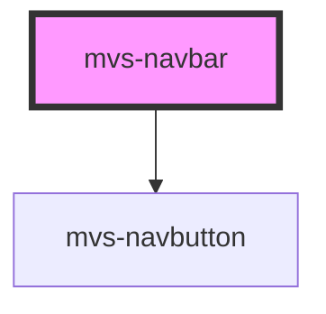

# mvs-navbar

<!-- Auto Generated Below -->

## Properties

| Property   | Attribute   | Description | Type     | Default |
| ---------- | ----------- | ----------- | -------- | ------- |
| `setClass` | `set-class` |             | `string` | `' '`   |

## Dependencies

### Depends on

- [mvs-navbutton](../mvs-navbutton)

### Graph

----------------------------------------------

*Built with [StencilJS](https://stenciljs.com/)*
