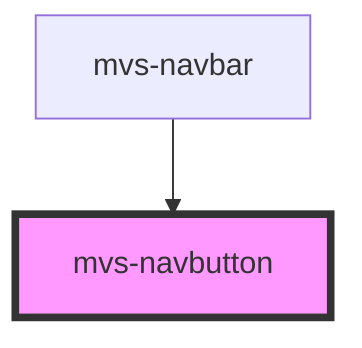

# mvs-navbutton

<!-- Auto Generated Below -->

## Properties

| Property     | Attribute    | Description | Type      | Default    |
| ------------ | ------------ | ----------- | --------- | ---------- |
| `contained`  | `contained`  |             | `boolean` | `false`    |
| `disabled`   | `disabled`   |             | `boolean` | `false`    |
| `marginzero` | `marginzero` |             | `boolean` | `false`    |
| `outlined`   | `outlined`   |             | `boolean` | `false`    |
| `type`       | `type`       |             | `string`  | `'button'` |

## Dependencies

### Used by

 - [mvs-navbar](../mvs-navbar)

### Graph

----------------------------------------------

*Built with [StencilJS](https://stenciljs.com/)*
