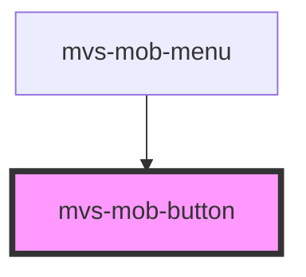

# mvs-mob-button

<!-- Auto Generated Below -->

## Properties

| Property | Attribute | Description | Type      | Default |
| -------- | --------- | ----------- | --------- | ------- |
| `open`   | `open`    |             | `boolean` | `false` |

## Dependencies

### Used by

 - [mvs-mob-menu](../mvs-mob-menu)

### Graph

----------------------------------------------

*Built with [StencilJS](https://stenciljs.com/)*
