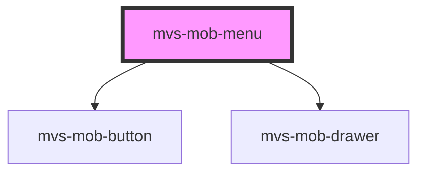

# mvs-mob-menu

<!-- Auto Generated Below -->

## Properties

| Property   | Attribute   | Description | Type      | Default      |
| ---------- | ----------- | ----------- | --------- | ------------ |
| `open`     | `open`      |             | `boolean` | `false`      |
| `setClass` | `set-class` |             | `string`  | `'menuroot'` |

## Dependencies

### Depends on

- [mvs-mob-button](../mvs-mob-button)
- [mvs-mob-drawer](../mvs-mob-drawer)

### Graph

----------------------------------------------

*Built with [StencilJS](https://stenciljs.com/)*
