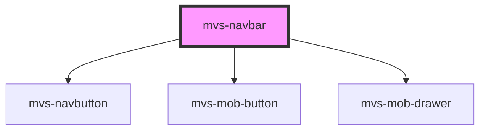

# mvs-navbar

<!-- Auto Generated Below -->

## Properties

| Property      | Attribute       | Description | Type                                                          | Default     |
| ------------- | --------------- | ----------- | ------------------------------------------------------------- | ----------- |
| `color`       | `color`         |             | `"default" \| "inherit" \| "primary" \| "secondary"`          | `'primary'` |
| `lastScrollY` | `last-scroll-y` |             | `number`                                                      | `0`         |
| `links`       | --              |             | `{ name: string; url: string; }[]`                            | `linkList`  |
| `logo`        | `logo`          |             | `string`                                                      | `'Logo'`    |
| `open`        | `open`          |             | `boolean`                                                     | `false`     |
| `position`    | `position`      |             | `"absolute" \| "fixed" \| "relative" \| "static" \| "sticky"` | `'fixed'`   |
| `setClass`    | `set-class`     |             | `string`                                                      | `''`        |

## Dependencies

### Depends on

- [mvs-navbutton](../mvs-navbutton)
- [mvs-mob-button](../mvs-mob-button)
- [mvs-mob-drawer](../mvs-mob-drawer)

### Graph

----------------------------------------------

*Built with [StencilJS](https://stenciljs.com/)*
