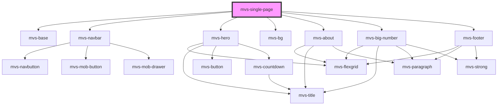

# mvs-single-page

<!-- Auto Generated Below -->

## Properties

| Property  | Attribute | Description | Type  | Default     |
| --------- | --------- | ----------- | ----- | ----------- |
| `data`    | `data`    |             | `any` | `undefined` |
| `numbers` | `numbers` |             | `any` | `undefined` |

## Dependencies

### Depends on

- [mvs-base](../../layout/mvs-base)
- [mvs-navbar](../../navigation/mvs-navbar)
- [mvs-hero](../../layout/mvs-hero)
- [mvs-bg](../../layout/mvs-bg)
- [mvs-about](../../sections/mvs-about)
- [mvs-big-number](../../layout/mvs-big-number)
- [mvs-footer](../../sections/mvs-footer)

### Graph

----------------------------------------------

*Built with [StencilJS](https://stenciljs.com/)*
