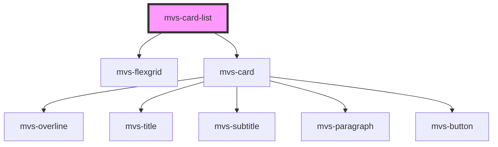

# mvs-card-list

<!-- Auto Generated Below -->

## Properties

| Property | Attribute | Description | Type                                                                                                   | Default |
| -------- | --------- | ----------- | ------------------------------------------------------------------------------------------------------ | ------- |
| `data`   | --        |             | `{ overline: string; title: string; subtitle: string; text: string; button: string; link: string; }[]` | `cards` |

## Dependencies

### Depends on

- [mvs-flexgrid](../../layout/mvs-flexgrid)
- [mvs-card](../../layout/mvs-card)

### Graph

----------------------------------------------

*Built with [StencilJS](https://stenciljs.com/)*
