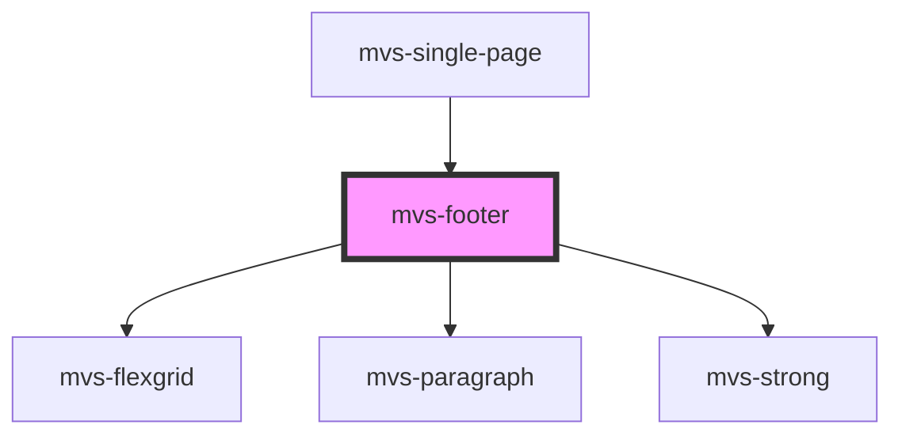

# mvs-footer

<!-- Auto Generated Below -->

## Properties

| Property | Attribute | Description | Type                         | Default                                                                                                                                   |
| -------- | --------- | ----------- | ---------------------------- | ----------------------------------------------------------------------------------------------------------------------------------------- |
| `icons`  | --        |             | `{ rodape_logo: string; }[]` | `[ 		{ 			rodape_logo: 				'https://admin.100anos.ufrj.br/wp-content/uploads/sites/3/2019/09/ufrj-logo-branco-small-medium.png', 		}, 	]` |

## Dependencies

### Used by

 - [mvs-single-page](../../pages/mvs-single-page)

### Depends on

- [mvs-flexgrid](../../layout/mvs-flexgrid)
- [mvs-paragraph](../../typography/mvs-paragraph)
- [mvs-strong](../../typography/mvs-strong)

### Graph

----------------------------------------------

*Built with [StencilJS](https://stenciljs.com/)*
