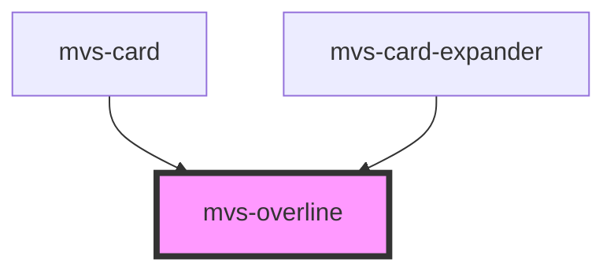

# mvs-overline

<!-- Auto Generated Below -->

## Properties

| Property | Attribute | Description | Type                                            | Default     |
| -------- | --------- | ----------- | ----------------------------------------------- | ----------- |
| `blah`   | `blah`    |             | `"string" \| 1 \| 2 \| 34`                      | `undefined` |
| `color`  | `color`   |             | `"dark" \| "light" \| "primary" \| "secondary"` | `undefined` |

## Dependencies

### Used by

 - [mvs-card](../../layout/mvs-card)
 - [mvs-card-expander](../../layout/mvs-card-expander)

### Graph

----------------------------------------------

*Built with [StencilJS](https://stenciljs.com/)*
