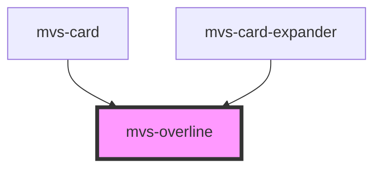

# mvs-overline

<!-- Auto Generated Below -->

## Dependencies

### Used by

 - [mvs-card](../../layout/mvs-card)
 - [mvs-card-expander](../../mvs-card-expander)

### Graph

----------------------------------------------

*Built with [StencilJS](https://stenciljs.com/)*
