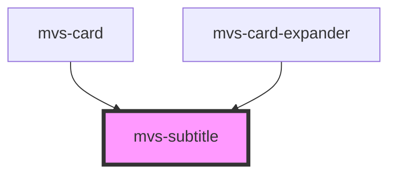

# mvs-subtitle

<!-- Auto Generated Below -->

## Properties

| Property | Attribute | Description | Type             | Default     |
| -------- | --------- | ----------- | ---------------- | ----------- |
| `type`   | `type`    |             | `"one" \| "two"` | `undefined` |

## Dependencies

### Used by

 - [mvs-card](../../layout/mvs-card)
 - [mvs-card-expander](../../mvs-card-expander)

### Graph

----------------------------------------------

*Built with [StencilJS](https://stenciljs.com/)*
