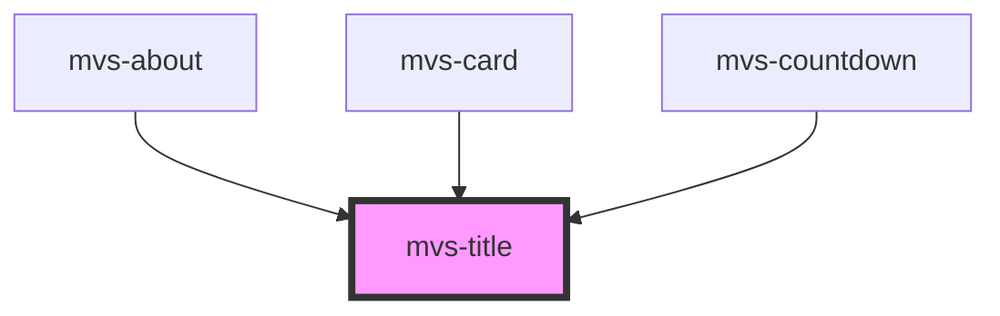

# mvs-title

<!-- Auto Generated Below -->

## Properties

| Property   | Attribute  | Description                                                         | Type                                                      | Default     |
| ---------- | ---------- | ------------------------------------------------------------------- | --------------------------------------------------------- | ----------- |
| `level`    | `level`    | Define estilo de título a ser usado pelo componente.                | `"t1" \| "t2" \| "t3" \| "t4" \| "t5" \| "t6" \| boolean` | `undefined` |
| `override` | `override` | Sobreescreve o tag html definido automaticamente.                   | `1 \| 2 \| 3 \| 4 \| 5 \| 6 \| boolean`                   | `undefined` |
| `rank`     | `rank`     | Propriedade interna que define automaticamente a tag H a ser usada. | `number`                                                  | `undefined` |
| `white`    | `white`    | Define texto de cor branca, para fundos escuros.                    | `boolean`                                                 | `undefined` |

## Dependencies

### Used by

 - [mvs-about](../../sections/mvs-about)
 - [mvs-card](../../layout/mvs-card)
 - [mvs-countdown](../../layout/mvs-countdown)

### Graph

----------------------------------------------

*Built with [StencilJS](https://stenciljs.com/)*
